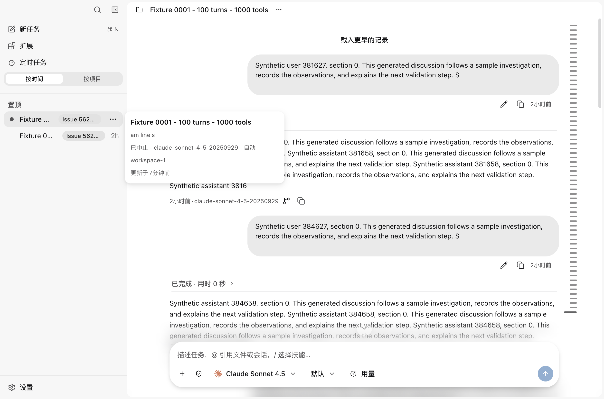
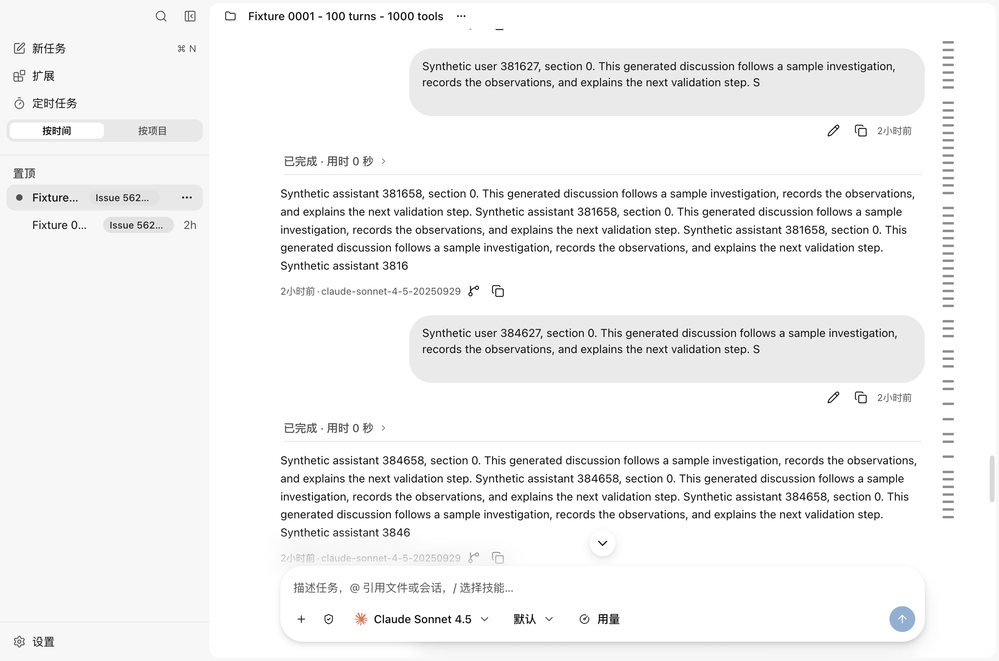

<!--
  Licensed to the Apache Software Foundation (ASF) under one
  or more contributor license agreements.  See the NOTICE file
  distributed with this work for additional information
  regarding copyright ownership.  The ASF licenses this file
  to you under the Apache License, Version 2.0 (the
  "License"); you may not use this file except in compliance
  with the License.  You may obtain a copy of the License at

      http://www.apache.org/licenses/LICENSE-2.0

  Unless required by applicable law or agreed to in writing,
  software distributed under the License is distributed on an
  "AS IS" BASIS, WITHOUT WARRANTIES OR CONDITIONS OF ANY
  KIND, either express or implied.  See the License for the
  specific language governing permissions and limitations
  under the License.
-->

# Session-switch performance evidence

2026-09-25. Product commit: `26086c9666c1fe1714e3f6dc6d7eae7296a574ab`, based on `99cfeb7e9` from main. This evidence branch is separate from the product PR; its benchmark drivers, statistical recipes, numerical samples and screenshots are review artifacts.

The change removes two kinds of unnecessary work when returning to a conversation: delivering a large history range before publishing the reader, and projecting an entire root session to answer a ShellRun resource query that cannot inherit anything.

## Implementation and tradeoffs

- A new reader requests a recent **128 KiB projected-message budget**; an earlier-history read uses **512 KiB**. Host page requests receive the relevant budget as well. Existing whole-Turn rules can exceed the requested budget; this is not a hard bound on input events, CPU or a very large individual Turn.
- Earlier history loads on upward reader input near the beginning. One pending request per conversation suppresses duplicate gestures; settling a page does not recursively fetch the rest. Existing reading anchors and recovery floors remain in use. No load-earlier button is required.
- Root-session ShellRun list/get requests check existing lineage before looking for inherited resources. Own resources still come from the ShellRun store; branch/revision inheritance, owner lookup and failure semantics remain covered by tests.
- No new database table, index, projection, durable cache, resident worker or protocol state is introduced. The existing transcript cache is unchanged. This does not solve arbitrary-distance anchor restoration, unbounded continuous backward reading, or exceptionally large individual Turns.

## Historical controlled comparisons

These comparisons were collected on `fb9df6c3d` plus successive implementations of this PR, **before rebasing onto current main**. They establish the effects of each change on the measured workloads. The final-commit checks below are separate; their times are not substituted into these before/after pairs.

Apple M2 Pro / 16 GiB, macOS Darwin 25.6.0 arm64, Electron 43.4.1. Production renderer in a locally packaged unsigned `.app` / ASAR. Synthetic histories, no real provider calls. CPU profilers off. OS caches were not flushed. Timing begins at actual Renderer pointerdown; a content frame is a DOM condition followed by two animation frames, not a compositor presentation timestamp or a settled streaming page.

| Comparison | n per side | Baseline p50 / p95 | Candidate p50 / p95 | p50 reduction |
|---|---:|---:|---:|---:|
| C: active Linux Host, 100 turns / 1,000 tools per session, +20 ms injected RTT; bounded first read only | 50 | 1,296.8 / 1,446.2 ms | 268.9 / 340.2 ms | 79.3% |
| B: idle local root; bounded reads already enabled, then lineage-before-history resource lookup | 50 | 10,945.5 / 41,720.1 ms | 663.2 / 720.4 ms | 93.9% |

C's useful-content endpoint requires current history loaded, current output present and continuing to grow after returning. The same non-terminated turn must advance before leaving, while away, and after return. Returns are paced by generation age in the controlled comparison; output length still varies with scheduling. +20 ms means 10 ms each direction, not a claim about WSL latency. The Linux Host uses Docker/LinuxKit and SQLite on a macOS bind mount.

In C, target subscription opens remain **0**. History-page requests decrease **20 → 2**, Renderer batches **41 → 3**, and Renderer payload **2,658,119 → 212,267 bytes**. First-batch-to-ready p50 decreases **1,031 → 56 ms**. Main-to-preload per-batch delivery is measured separately; this does not isolate all IPC or streaming scheduling overhead.

| C stage after pointerdown, independent p50 | Baseline | Bounded reader |
|---|---:|---:|
| Preload invokes open | 35.3 ms | 29.0 ms |
| First preload batch | 105.7 ms | 113.3 ms |
| Ready batch | 1,133.2 ms | 170.9 ms |
| Open resolves | 1,202.8 ms | 209.3 ms |
| Old content removed | 1,216.5 ms | 218.8 ms |
| Useful-content frame | 1,296.8 ms | 268.9 ms |

These timestamps are not additive exclusive CPU stages. Per-batch Main→preload transfer p50 is 1.080 → 0.424 ms, while aggregate synchronous Renderer transcript-handler time is 25.75 → 2.25 ms. First-batch arrival alone does not capture the much longer wait for a ready snapshot.

B's target has 300 turns / 6,448 tools; its source has 100 turns / 15,780 tools. The whole fixture is 302 sessions and a 1,154,646,016-byte SQLite database. These are **same-process returns after startup**, not launch-to-ready measurements. Every return in the resource-lookup comparison still delivers **176,468 bytes / 3 batches**: the second improvement does not come from further reducing history.

The old B group includes four connection recoveries and all resulting long tails; its p95 must not be described as a normal 41.7-second interaction. Spotlight activity and differing machine load also limit attribution of tails. A separate earlier ten-return baseline was about 10.99 seconds. The new fifty-return group had no reconnection and a maximum content frame of 879.9 ms.

For the complete B target→source→target cycle plus 1.5 seconds of observation, Host CPU p50 decreases **14.135 → 0.210 CPU seconds**, and total observed-process CPU **19.396 → 2.862 CPU seconds**. Host sampled peak RSS p50 decreases **2,560.1 → 211.5 MiB**; the candidate group's highest sampled value is 277.1 MiB. Sampling is every 200 ms, not an OS peak-memory guarantee. The candidate's post-display Host CPU increase has p50 0 and maximum 0.01 CPU seconds at the sampling precision: no deferred full replay was observed.

Closed B baseline/candidate databases retain the same size, schema hash and 185,930 RuntimeEvents, with no WAL remaining. The original manifest's 185,926 was the generation-time count. This is a size/schema/row-count check, not an OS write-amplification measurement. C adds events for actual controlled generation and stopping; schema is unchanged.

## Combined implementation and scale checks before rebase

| Workload | n | Content p50 / p95 |
|---|---:|---:|
| C active remote, 100 turns/session, combined bounded reads + resource fix | 50 | 293.3 / 371.1 ms |
| C active remote, 1,000 turns/session | 10 | 277.3 / 411.7 ms |
| Idle local, 100 turns × 10 tools/session | 10 | 229.4 / 255.4 ms |
| Idle local, 1,000 turns × 10 tools/session | 10 | 257.8 / 381.9 ms |

All combined C samples passed same-turn, while-away output growth and post-return growth checks, with 2 pages / 3 batches / 0 new target subscriptions. The earlier P1-only 1,000-turn continuity failure is retained as a failed campaign, not folded into successful statistics. Ten-sample p95 is the maximum and is only an initial tail check. Other B checks covered rapid returns, 1.5-second source dwell and reverse direction; their ten-sample maxima were 693.3, 717.0 and 823.3 ms respectively.

The combined 100-turn C timing is slightly higher than the P1-only group. Generation age was matched but output counts and machine load differed; the report does not attribute that difference solely to the resource fix or claim every metric improved.

## Final commit verification

Current main adds a placement gate and fade-in. The old DOM probe does not by itself prove that those rows are visible. Final checks therefore record **both** the earlier DOM-content endpoint and an additional frame after `data-placed` and opacity ≥0.99. A/C also require target content intersecting the transcript viewport; B checks its historical anchor before waiting for the placement/fade gate. This latter endpoint includes intentional animation time, and is still a browser observation rather than a physical pixel timestamp. No direct percentage comparison is made between different endpoint definitions.

| Final workload | n | Protocol ready p50 / p95 | DOM/useful frame p50 / p95 | Placement/fade frame p50 / p95 |
|---|---:|---:|---:|---:|
| A packaged; idle | 10 | 338.9 / 399.4 ms | 756.4 / 812.2 ms | 937.5 / 992.7 ms |
| A packaged; active | 10 | 439.6 / 484.7 ms | 889.8 / 1,018.8 ms | 1,106.8 / 1,252.4 ms |
| B packaged; idle | 10 | 301.0 / 338.7 ms | 690.1 / 727.8 ms | 835.0 / 881.9 ms |
| C packaged, +20 ms RTT; active | 10 | 180.6 / 201.2 ms | 312.6 / 367.5 ms | 478.8 / 533.8 ms |
| C dev, +20 ms RTT; active | 10 | 277.4 / 285.3 ms | 476.4 / 610.6 ms | 614.0 / 807.5 ms |

Initial current-main runs using only the old DOM endpoint are retained separately. A preliminary visibility-probe trial reused a fixture after controlled generation; it is excluded from the fresh-fixture table above. Final groups each start from a fresh isolated clone. A's legacy one-sample measurements used pre-click timing and are not used to compute a speedup.

## Correctness and ablation

- Current-main build, complete workspace typecheck, repository lint/format checks, Desktop/UI Knip, Storybook build and staged license/protocol/diff guards pass.
- Affected Runtime, Runtime Host, UI and Desktop compiled suites: **9,148 passed, 26 conditionally skipped, 0 failed** (591 suites).
- Seven Chromium Storybook scenarios pass their `play` assertions: prepend anchor ≤1 px, measured heights, nested scroller isolation, filtered Work history, released reader position, return-to-tail and virtual history continuity.
- Reverting the initial history budget to 64 MiB makes the bounded-reader regression fail. Removing the per-conversation pending guard makes the duplicate-upward-read test fail.
- Restoring the old list and get resource-query ordering separately makes the root-session no-history-read regression fail. Compiled modules are restored byte-for-byte after each mutation; **77 focused tests pass afterward**.
- Earlier packaged mouse-wheel checks loaded more history without a button, avoided mount-time/full recursive reads, and restored a reading anchor outside the initial range. Unit/contract coverage includes complete Turns, fragments, recovery floors, stale requests, failures, branch/revision resource ownership and pending-import readiness.

No large optimization abstraction survived merely because it was tried: the implementation consists of existing read-budget selection, upward-input paging with one pending flag, and earlier lineage checks. There is no second history representation to maintain.

## Visible behavior

These synthetic-fixture screenshots were captured during the implementation campaign, before the rebase. Browser assertions on the final commit verify the same automatic paging behavior.

Before, with the existing load-earlier button:

After upward scrolling automatically loads history:

## Reproduction and limits

See [benchmark instructions](BENCHMARKS.md). The adjacent JSON files contain numerical per-return samples and aggregate metrics, with paths, credentials, wire contents and transcript text omitted. Recipes contain synthetic IDs and statistical shapes; generated prompts/results are synthetic.

The exact Windows 11 / WSL2 workload, original Node 26.2.0 environment, and approximate five-second stable-page milestone from #5627 were not reproduced. Controlled text streaming is not a real LLM/tool-execution workload. The locally packaged app omits the optional unbuilt Direct peer addon; remote testing uses authenticated WebSocket. The claims concern the measured transfer/replay bottlenecks and responsiveness, not proof of identical behavior on every platform.

Startup Host-ready/composer/input measurements from #5556 belong to a separate startup plan and are not presented as session-switch improvements here. Long branch histories, giant single Turns and far reading-position recovery retain their existing costs.

Prepared and submitted with Codex assistance at the contributor's direction.
